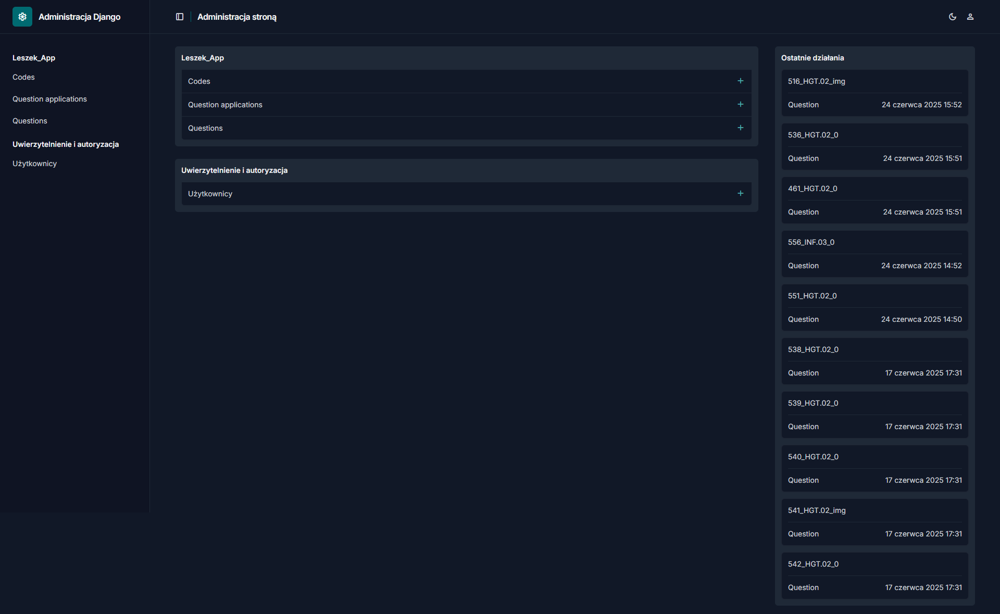

# Welcome to L.E.S.Z.E.K (Losowy Egzaminator Szkolny Z Egzaminów Klasyfikacyjnych)


## Omówienie

L.E.S.Z.E.K jest systemem mającym na celu pomoc uczniom przystępującym do egzaminów zawodowych. Głównie skupia się on na ZSAT w Ropczycach jednak jest on otwarty dla każdego. Poniżej znajdują się instrukcje dla ambitnych i pełnych energii (jeszcze) programistów, którzy chcą się przyczynić do projektu. Repozytorium może posłużyć również jako materiał edukacyjny/treningowy dla tych, którzy chcą nauczyć się pracować i przyczyniać się do publicznych projektów.

Jeśli znajdzie się ktoś chętny na długotrwałe i aktywne wspieranie/przejęcie projektu, dajcie nam znać (najlepiej przez github discussions), a przedyskutujemy wszelkie szczegóły.

## Przygotowanie dla developerów

Projekt został stworzony przy użyciu pythona >=3.12.3 oraz biblioteki [Django](https://www.djangoproject.com/ 'Dokumentacja Django').

Systemu należy używać poprzez wirtualne środowisko pythona. Po sklonowaniu repozytorium należy jednorazowo stworzyć to środowisko.
Aby je stworzyć postępuj wedle następujących kroków.

1. Stwórz wirtualne środowisko (nazwę "leszek" można zastąpić dowolną nazwą)

```pwsh
$  py -m venv leszek
```

2. Zainstaluj wymagane biblioteki poprzez

```pwsh
$  pip install -r requirements.txt
```

## Jak zacząć

Wszystkie akcje wykonuj używając wirtualnego środowiska pythona. Aby do niego wejść wykonaj poniższe kroki.

1. Jeśli używasz powershell użyj

```pwsh
$ Set-ExecutionPolicy Unrestricted -Scope Process
```

2. Następnie uruchom skrypt "activate" znajdujący się w folderze L.E.S.Z.E.K

```pwsh
$ .\leszek\Scripts\activate
```

3. Przeprowadź migracje aby baza danych została zinicjalizowana

```pwsh
$ py manage.py migrate
```

4. Zaimportuj dane, najpierw importując kody z pliku `\import_data\codes.json`, a następnie przykładowe pytania z pliku `\import_data\questions_export.json` lub pytania z aktualnej bazy danych.

## Jak włączyć serwer

1. Przejdź do folderu leszek_projekt

```pwsh
$ cd .\leszek_projekt
```

2. Aby uruchomić serwer użyj komendy:

```pwsh
$ py manage.py runserver
```

## Jak zaimportować dane z systemu A.S.P.E.K.T

1. Do folderu "leszek_projekt\import_data" przenieś plik "questions_import.json" otrzymany po użyciu A.S.P.E.K.T

2. Użyj komendy:

```pwsh
$ py manage.py loaddata .\import_data\questions_export.json
```

Lub użyj ✨panelu admina✨ ;)



Następnie do folderu "leszek_projekt\static_files\media" przenieś wszystkie pliki otrzymane po użyciu A.S.P.E.K.T (powinny znajdować się w folderze "media")

## Contributing

- Błędy/buggi reporting: [GitHub Issues](https://github.com/BigPeanutFromStudio/L.E.S.Z.E.K/issues)
- Pull request są mile widziane ale polecamy wtedy przejęcie repo.
